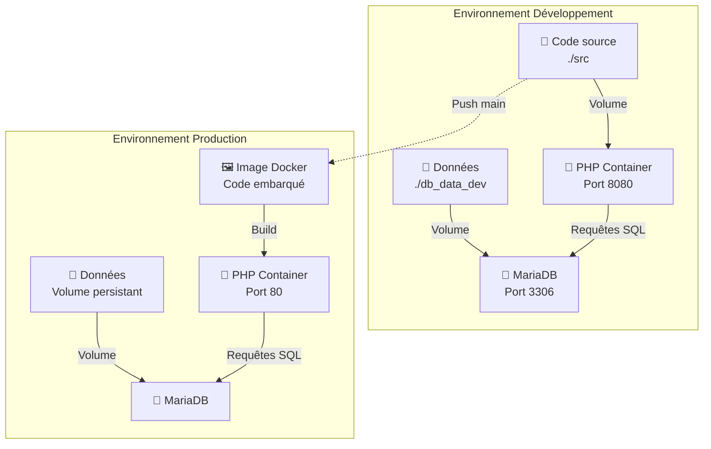
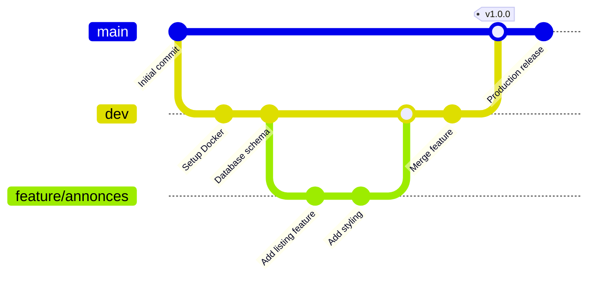

# Vide Grenier

[](https://www.php.net)
[](https://www.docker.com)
[](https://docs.docker.com/compose)
[](https://mariadb.org)
[](https://git-scm.com)

Plateforme web de gestion d'annonces pour un vide grenier. Application PHP + MariaDB containerisée avec Docker.

## Architecture

Le projet comprend deux environnements Docker:

- **Développement**: 2 conteneurs (PHP + MariaDB), code source exposé pour le développement
- **Production**: 2 conteneurs (PHP avec code embarqué + MariaDB persistante)



## Prérequis

- Docker et Docker Compose
- Git

## Démarrage - Environnement Développement

L'environnement de développement expose le code source pour la modification en direct et permet le rechargement automatique.

```bash
./start-dev.sh
```

L'application sera accessible à `http://localhost:8080`

**Services**:
- PHP: http://localhost:8080
- MariaDB: localhost:3306

## Démarrage - Environnement Production

L'environnement de production construit une image Docker intégrant le code et utilise des volumes persistants pour la base de données.

```bash
./start-prod.sh
```

L'application sera accessible à `http://localhost:80`

**Services**:
- PHP: http://localhost
- MariaDB: localhost:3306 (volume persistant)

## Arrêt des environnements

```bash
# Développement
docker-compose down -v

# Production
docker-compose -f docker-compose.prod.yml down -v
```

## Structure du projet

```
.
├── src/                      # Code source PHP
│   ├── index.php            # Application principale
│   └── style.css            # Feuille de style
├── db/                       # Scripts d'initialisation base de données
├── docker-compose.yml        # Configuration environnement développement
├── docker-compose.prod.yml   # Configuration environnement production
├── DockerFile               # Image PHP personnalisée
├── start-dev.sh            # Script de démarrage développement
└── start-prod.sh           # Script de démarrage production
```

## Workflow Git

Le projet utilise GitFlow:

- `main`: version stable en production
- `dev`: branche d'intégration des développements
- `feature/*`: branches de développement des fonctionnalités

Les changements sont intégrés via pull requests et vérifiés avant merge.



## Déploiement d'une fonctionnalité

1. Créer une branche depuis `dev`
2. Développer et tester en environnement de développement
3. Pusher vers la branche et créer une PR vers `dev`
4. Après validation et merge, créer une PR `dev` → `main`
5. Redémarrer l'environnement de production pour déployer les changements
